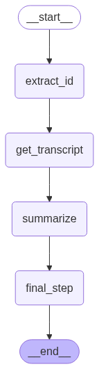
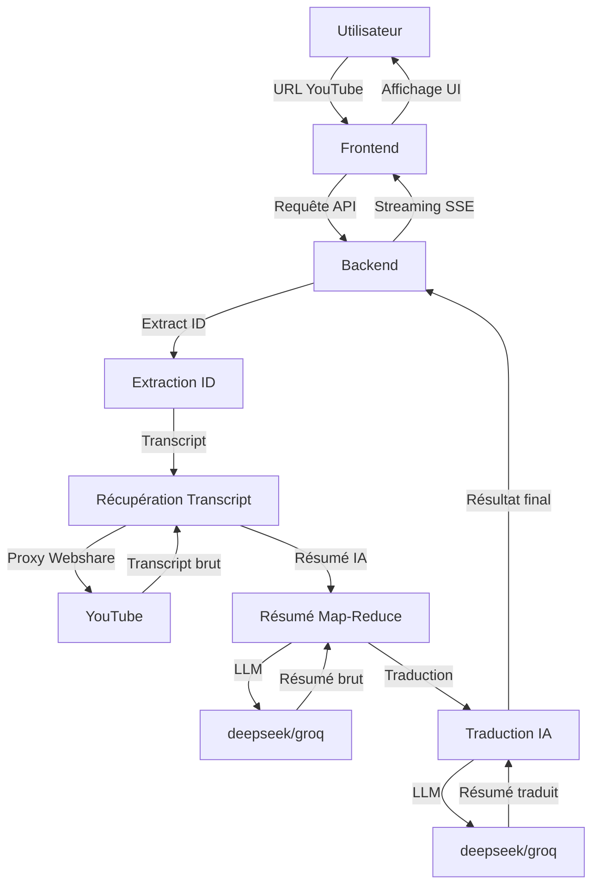

# Zenyth

Zenyth est une application alimentée par l’IA qui extrait, transcrit, résume et traduit le contenu de vidéos YouTube. Elle propose une interface web moderne où l’utilisateur peut saisir une URL YouTube et obtenir un résumé structuré, dans la langue et le niveau de détail de son choix.



## Fonctionnalités

- **Extraction automatique de transcript YouTube**
- **Résumé IA multi-niveaux** : Choix du niveau de détail (très bref à très complet)
- **Traduction multilingue** : Résumé disponible dans n’importe quelle langue (anglais, français, espagnol, etc.)
- **Interface utilisateur moderne** : UI responsive, feedback en temps réel, affichage Markdown enrichi
- **Suivi de progression détaillé** : Affichage dynamique des étapes du workflow (extraction, transcript, résumé, traduction)
- **Gestion avancée des erreurs** : Retour précis à chaque étape, logs détaillés
- **Proxy rotatif Webshare** : Contournement des limitations YouTube
- **Rotation de clés API** : Pour éviter les quotas sur les LLM

## Aperçu du workflow

Zenyth s’appuie sur un workflow modulaire orchestré par LangGraph :



## Prérequis

- Docker & Docker Compose
- Un nom de domaine pointant vers votre serveur
- Un compte Webshare avec proxy résidentiel rotatif
- Clé(s) API OpenRouter (ou Groq)
- Python 3.9+ (pour le développement local)

## Installation

### 1. Cloner le dépôt

```bash
git clone <repository-url>
cd zenyth
```

### 2. Configurer les variables d’environnement

```bash
cp backend/.env.example backend/.env
```

Remplissez le fichier `.env` :

```
# Proxy Webshare
WEBSHARE_PROXY_USERNAME=your_username
WEBSHARE_PROXY_PASSWORD=your_password

# Clés API LLM (séparées par des virgules)
OPENROUTER_API_KEYS=key1,key2,key3

# Tracing LangSmith (optionnel)
LANGCHAIN_TRACING_V2=true
LANGCHAIN_API_KEY=your_langchain_api_key
LANGCHAIN_PROJECT=zenyth

# Infos site
YOUR_SITE_URL=https://your-domain.com
YOUR_SITE_NAME=Zenyth
```

### 3. Configurer Nginx (reverse proxy)

Voir la configuration exemple dans le README d’origine.

### 4. Lancer les services

```bash
docker compose up -d --build
```

## Guide d’utilisation

### Accès à l’interface web

Ouvrez votre navigateur sur votre domaine (ex : `https://your-domain.com`).

### Soumettre une URL YouTube

1. Collez l’URL d’une vidéo YouTube
2. Choisissez la langue du résumé (ex : english, français, espagnol…)
3. Choisissez le niveau de détail du résumé (slider : très bref à très complet)
4. Cliquez sur « Generate Summary »
5. Suivez la progression en temps réel (étapes, erreurs éventuelles)
6. Consultez le résumé (formaté Markdown) et le transcript (expandable)

### Options avancées

- **Niveau de détail** : 5 niveaux (brief, short, standard, detailed, comprehensive)
- **Langue** : n’importe quelle langue prise en charge par le LLM
- **Affichage Markdown** : titres, listes, emphase, etc.
- **Streaming SSE** : résultats affichés au fur et à mesure
- **Logs et erreurs détaillés**

## Développement local

1. Cloner le dépôt
2. Installer les dépendances backend :
   ```bash
   cd backend
   pip install -r requirements.txt
   ```
3. Installer les dépendances frontend :
   ```bash
   cd frontend
   npm install
   ```
4. Créer et configurer le `.env`
5. Lancer le backend :
   ```bash
   cd backend
   uvicorn api:app --reload
   ```
6. Lancer le frontend :
   ```bash
   cd frontend
   npm run dev
   ```

## Structure du projet

- `backend/` : FastAPI + LangGraph
  - `api.py` : Endpoints API
  - `agent.py` : Workflow LangGraph (étapes, gestion erreurs, logs)
  - `tools.py` : Outils d’extraction, résumé, traduction
  - `config.py` : Configuration centralisée
  - `src/` : Fonctionnalités cœur
    - `video_tools.py` : Extraction transcript YouTube
    - `summarize.py` : Résumé Map-Reduce multi-niveaux
    - `translation.py` : Traduction multilingue
- `frontend/` : Next.js
  - `app/` : App principale
  - `components/` : Composants React (UI, SVG, Footer, Hero)
  - `public/` : Assets statiques

## Crédits

- [youtube-transcript-api](https://github.com/jdepoix/youtube-transcript-api)
- [Webshare](https://www.webshare.io/)
- [FastAPI](https://fastapi.tiangolo.com/)
- [LangChain](https://langchain.com/)
- [LangGraph](https://github.com/langchain-ai/langgraph)
- [Next.js](https://nextjs.org/)
- [OpenRouter](https://openrouter.ai/)
- [Nginx](https://nginx.org/)
- [Docker](https://www.docker.com/)

## Licence

Projet sous licence MIT.

## Contact

Pour toute question ou contribution, ouvrez une issue ou contactez l’auteur.
